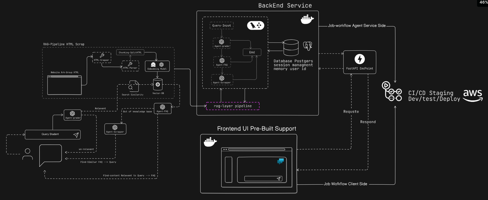

# FAQ AGENTIC FLOW System

[](https://opensource.org/licenses/MIT)
[](https://www.python.org/downloads/)

## Overview

An intelligent FAQ assistant system built with multi-agent architecture using LangChain and LangGraph. The system transforms stateless LLM interactions into stateful conversations through PostgreSQL-based session management and RAG (Retrieval-Augmented Generation) pipeline.




## Table of Contents

1. [System Architecture](#system-architecture)
2. [Key Features](#key-features)
3. [Quick Start](#quick-start)
4. [Development Setup](#development-setup)
5. [Production Deployment](#production-deployment)
7. [Configuration](#configuration)

## System Architecture

### Multi-Agent Pipeline

The FAQ AGENTIC FLOW system implements a sophisticated multi-agent architecture:

- **Grader Agent**: Query preprocessing and relevance filtering
- **FAQ Agent**: Central response generation with session memory
- **Scrapper Agent**: Intelligent fallback with extended search capabilities
- **Orchestrator**: LangGraph-based workflow coordination

### Core Components

- **RAG Pipeline**: Automated content acquisition and vector storage
- **Session Management**: PostgreSQL-based conversation persistence
- **Knowledge Base**: Chroma + FAISS vector stores for semantic search
- **Workflow Engine**: LangGraph orchestration for agent coordination

## Key Features

**Architecture**
- Multi-stage Docker builds with security best practices
- Comprehensive CI/CD pipeline with GitHub Actions
- Environment-specific configurations (dev/staging/production)

**Intelligent Agent System**
- Context-aware responses with conversation history
- Three-tier fallback strategy for coverage
- Real-time query preprocessing and intent classification


## Quick Start

### Prerequisites

- Python 3.11+
- Docker and Docker Compose
- [uv](https://docs.astral.sh/uv/) package manager

### 1. Clone Repository

```bash
git clone https://github.com/deep-matter/FAQ-Agent
cd /FAQ-Agent
```

### 2. Environment Setup

```bash
# Copy environment template
cp .env.example .env

# Edit .env with your configuration
# Required: OPENAI_API_KEY, database credentials
```

### 3. Start with Docker Compose

```bash
docker-compose up -d
docker-compose logs -f faq-agent
```

## Development Setup

### Using uv (Recommended)

```bash
curl -LsSf https://astral.sh/uv/install.sh | sh

uv sync --all-extras --dev

source .venv/bin/activate  # On Windows: .venv\Scripts\activate

uv run uvicorn main:app --reload --host 0.0.0.0 --port 8000
```

### Database Setup

```bash
docker-compose up -d postgres
```


### Code Quality

```bash
# Format code
uv run ruff format .

# Lint code
uv run ruff check .

# Type checking
uv run mypy app/
```

## Production Deployment

### Docker Production Build

```bash
# Build production image
docker build --target production -t faq-agent:latest .

# Run production container
docker run -d \
  --name faq-agent \
  -p 8000:8000 \
  --env-file .env \
  faq-agent:latest
```

### AWS ECS Deployment

The repository includes GitHub Actions workflows for automated deployment to AWS ECS:

1. **Staging**: Deploys from `develop` branch to staging environment
2. **Production**: Deploys from `main` branch to production environment

### Environment Variables

Key  environment variables:

```bash
OPENAI_API_KEY=your_openai_api_key_here
DB_HOST=localhost
DB_NAME=faq_db
DB_USER=faq_user
DB_PASSWORD=your_secure_database_password
DB_PORT=5432
ENVIRONMENT=development
LOG_LEVEL=INFO
API_HOST=0.0.0.0
API_PORT=8000
VECTOR_STORE_PATH=./db/chroma_db_faq
CHUNK_SIZE=1000
CHUNK_OVERLAP=0
SCRAPING_TIMEOUT=30
MAX_SCRAPING_RETRIES=3
FAQ_URLS=https://your-website.com/faq,https://your-website.com/help
GRADER_MODEL=o3-mini
FAQ_AGENT_MODEL=o3-mini
SCRAPPER_MODEL=4o-mini
EMBEDDING_MODEL=text-embedding-3-small
DEBUG=false
RELOAD=false
```
### Core Settings

All configuration is managed through environment variables. See `.env.example` for comprehensive options:

- **Database**: PostgreSQL connection and pool settings
- **AI Models**: OpenAI API configuration and model selection
- **Monitoring**: Logging levels 

### Vector Store Configuration

- **Chunk Size**: 1000 characters (configurable)
- **Overlap**: 0 characters (configurable)
- **Similarity Search**: Top-3 retrieval with 0.7 threshold
- **Embedding Model**: text-embedding-3-small
s

### Logging

Structured JSON logging with configurable levels:
- Request/response logging
- Error tracking with stack traces

## Project Structure

```
FAQ-Agent/
├── app/                    # Application source code
│   ├── __init__.py
│   ├── main.py            # FastAPI application entry point
│   ├── agents/            # Multi-agent implementations
│   │   ├── __init__.py
│   │   ├── grader.py      # Query preprocessing & relevance filtering
│   │   ├── faq_agent.py   # Central response generation
│   │   └── scrapper.py    # Intelligent fallback agent
│   ├── api/               # FastAPI routes and models
│   │   ├── __init__.py
│   │   ├── routes.py      # API endpoints
│   │   └── models.py      # Request/response models
│   ├── config/            # Configuration management
│   │   ├── __init__.py
│   │   └── settings.py    # Environment settings
│   ├── core/              # Core business logic
│   │   ├── __init__.py
│   │   ├── pipeline.py    # FAQ AGENTIC FLOW pipeline
│   │   └── session_manager.py  # PostgreSQL session management
│   ├── database/          # Database connections and setup
│   │   ├── __init__.py
│   │   ├── connection.py  # Database connection management
│   │   └── setup.py       # Database initialization
│   └── workflow/          # LangGraph orchestration
│       ├── __init__.py
│       └── orchestrator.py  # Agent workflow coordination
├── requirements.txt       # Python dependencies
├── docker-compose.yml     # Development environment
├── main.py            # FastAPI application entry point
├── Dockerfile            # Production container
├── init.sql              # Database schema
├── .env.example          # Environment template
└── README.md             # This file
```